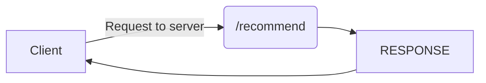

# Welcome to Back-end Code Testing!

In the following **Readme** file I have explained my whole project and how I were able to fix the problem with fetching data from the JSON file, analyise it and store it in mongoDB. and then fetch it with the **profitability** property.

## Compile and deployment instructions:

This project is very easy to setup and only need few commands running in order to make it fully functional.
**_First_** download the data JSON file from this **[link](https://static.polarr.co/hiring/backend/threads.json.zip)** after downloading the file make sure to extract it and copy the file **threads.json** and put a copy of it in the following directoy

    PROEJCT_ROOT => data => threads.json

make sure that the file is named **threads.json**

next you have to go to the project root and create/edit **.env** file and modify a value in it

    MONGODB_URL=mongodb+srv://<USERNAME>:<PASSWORD>@cluster0-70xh0.mongodb.net/<DB_NAME>

after modifiying this variable you will be able to connect to your database through our application; not modifing it will cause an **ERROR**

after doing that make sure to run these commands in the following order.

    npm run install (to install dependencies)
    npm run seed (to seed the data from the file into database)
    npm run start (start the project in production mode)

**HINT:**

    scripts: {
    	"seed": "node -e 'require(\"./seeds/index.js\").seedData(RECORD_NUMBER)'"
    }

running the `npm run seed` will fetch the data from the JSON file into the database as JSON file has over than 80000 record it is recommended to replace the `RECORD_NUMBER` with the amount of records you want to fetch to your database.

## Logic Behind The `npm run seed`:

seeding is one of the most important function to be invloded the script, it works in the following order.

1.  **Delete** current records in the database
2.  Fetch Data from the JSON file and filter the data out with categories to make sure only the **"For Sale"** products are inserted.
3.  while inserting the records we create statistics about three fields values (**price-replyCount-viewCount**) --- see the Algorithem section for more information
4.  after inserting data we modify each item **profitability** property.
5.  we stop the script and show user that seeding is done

## Data Modeling:

We have 4 collections in our database

- Item
- PriceProfitability
- ViewCountProfitability
- ReplyCountProfitability

the `Item` collection is representing the `Thread` object coming from the JSON data file
it has the following data modeling

```json
{
	threadId: { type:  String },
	threadTitle: { type:  String },
	threadUrl: { type:  String },
	profileUrl: { type:  String },
	avatarUrl: { type:  String },
	userName: { type:  String },
	replyCount: { type:  Number },
	viewCount: { type:  Number },
	articleHTML: { type:  String },
	articleText: { type:  String },
	threadProperties: [{ type:  String }],
	type: { type:  String },
	currency: { type:  String },
	shipping_destinations: { type:  String },
	price: { type:  Number },
	priceInUsd: { type:  Number },
	profitability: { type:  Number },
	profitability_percentage: { type:  String },
}
```

almost all the fields are easy to be understanded yet the `profitability` and `profitability_percentage`
where these two represent the the profitability of each item after doing an algorithem on it.

the three other collection have the same data structure:

```json
count: {type:  Number,},
total: {type:  Number,},
sum: {type:  Number,}
```

`count` represent the number of items that has been inserted in the database
`total` represent the total of the values that the field has been assigned to for example `price` field has the total of prices in all products inserted in the DB in order to fetch the sum.
`sum` represent the sum of these data **count/total** that will be used in our algorithem.

## Algorithm strategy and point system:

to get the `profitability` for each item we have run each on of them under a point system that calculate the chance this item can be sold again.

---

KEEP IN MIND THAT WE TAKE IN MIND THAT CUSTOMER BEHAVIOR FOR PURCHASING THIS PRODUCT DEPEND ON THREE POINTS:

**1. ITEM PRICE 2. NUMBER OF VIEWS FOR THE ITEM 3. NUMBER OF REPLIES AND COMMENTS IN THAT ITEM**

---

we took three main points in that.

1.  `price` the price of each item
2.  `replyCount` assuming it represet how many reply has been made on this post (people interacting with a post)
3.  `viewCount` assuming it represet how many users has viewed this item (seen it from inside the page)

the point perfect score is `100%` splited into:

- `price` **50%**
- `replyCount` **35%**
- `viewCount` **15%**

each one of those three fields are splited into 3 main categories in order to get the percentage of the level it is in:

- `Low` **0-40%**
- `Normal` **40-60%**
- `Hight` **60-100%**

and to calculate the distance we take the normal value and then we calculate the **HIGH LEVEL** by doing the following math:
`NORMAL_LEVEL * 1.5`
for the **LOW LEVEL** we do the following math:
`NORMAL_LEVEL / 1.5`
this allows us to put a range for each LEVEL

#### exmaple:

let us say that the sum of the three properties are splitted into the following:
| PRICE |VIEWS |REPLY |
|----------------|-------------------------------|-----------------------------|
|797 |286 |9 |

and we get an item with the following data:
| PRICE |VIEWS |REPLY |
|----------------|-------------------------------|-----------------------------|
|280 |438 |3|

the **profitability** would equal **_18_**
here is how we calculated it:

**NOTE:** PRICE TOTAL PERCENTAGE IS **50%**

`PRICE_HIGHT_LEVLE` = 797 \* 1.5 = 1196 and up --> 60%-100% of total
`PRICE_LOW_LEVEL` = 797 / 1.5 = 532 and lower --> 0%-40% of total
`PRICE_NORAML_LEVEL` = anything between `PRICE_HIGHT_LEVLE` and `PRICE_LOW_LEVEL` --> 40%-60% of total

for the `PRICE` in the item it is in the `PRICE_LOW_LEVEL` so that means it is between 0%-40%
now let us calculate how percentage it is in this level

    number_percentage = (NUMBER * 100) / PRICE_LOW_LEVEL;
    number_percentage = (LOW_POINT_PERCENTAGE(40%) * number_percentage) / (100 * 100);
    number_percentage = number_percentage * 100;

- **number_percentage**: result of each step
- **NUMBER**: the item property value => price for the above example
- **LOW_POINT_PERCENTAGE**: the % of the LOW_LEVLE => 40%
- **PRICE_LOW_LEVEL**: the LOW_RANGE of the property

this will get us the % of the number from the **LEVEL** now let us calculate the percentage out from the `PRICE` percentage `50% of total result`

`number_percentage = Math.round((number_percentage * percentage_value) / 100);`

- **number_percentage**: the number we get from the previous calculation
- **percentage_value**: the % of the property (for Price it is 50%)

now we get the % of the **profitability** for the price, we do the same now for all the 2 other remaining fields.

then we calculate them all to get the total percentage which represent the **profitability**.

# HTTP Requests:

out API contains only one end-point, which is the `/recommend` end point.
the following URL accepts two query params:

- page: the number of page to query from
- limit: items per page to show

the endpoint return the items sorted by the **profitability** **descending**
the response of this endpoint you can expect the following JSON format:

```json
{
	"items": [...],
	"total_items": 480,
	"total_pages": 24,
	"next_page": true,
	"current_page": 1
}
```

- **items**: an array of data that contains the items and there data
- **total_items**: the number of total items we have in the database
- **total_pages**: the total pages we can query from
- **next_page**: a boolean value to check if there is a next page
- **current_page**: the page u are already at

## UML diagrams

the below chat explain how we can make a request and what we expect from the application to behave like



## Notes and why I like my solution:

I developed a solution that consider **CUSTOMER** behavior and can be extended very easily to not just 2 or 3 fields it can be extended to as much fields as you want just give each one of them a percentage from the total and that is it.
also we take in consider the **CUSTOMER** point of view about any item which is the **price**, then it keep going with other sutff such looking for user interacting with a product so even if the product has a high number of views but the price is hight it will take that in mind when calculating stuff around.

the solution follows the best **OOP** pattrent and is very flexable as it allows us to change and manipulate any data we have.
also we are able to get data into chunks which speed up the loading of a request, user can control how many items he wants to get also the developer are able to load as much items as he wants with the

    npm run seed

last point is that this is a very well documented API that explain everything in details.
